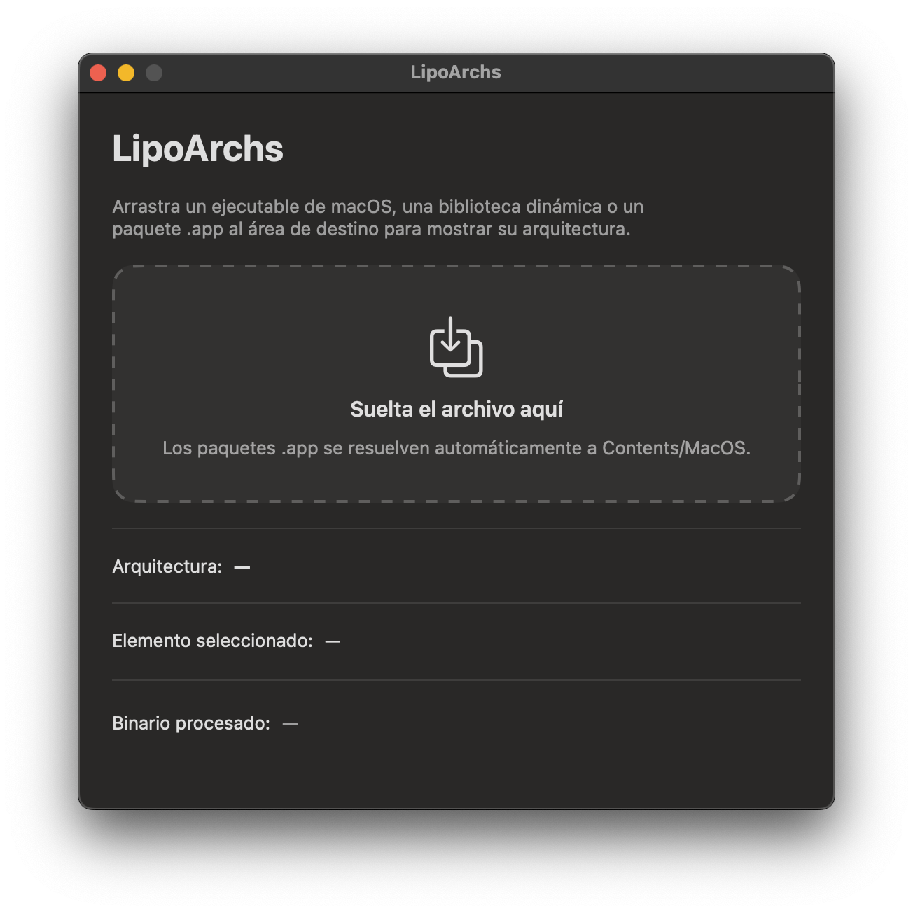
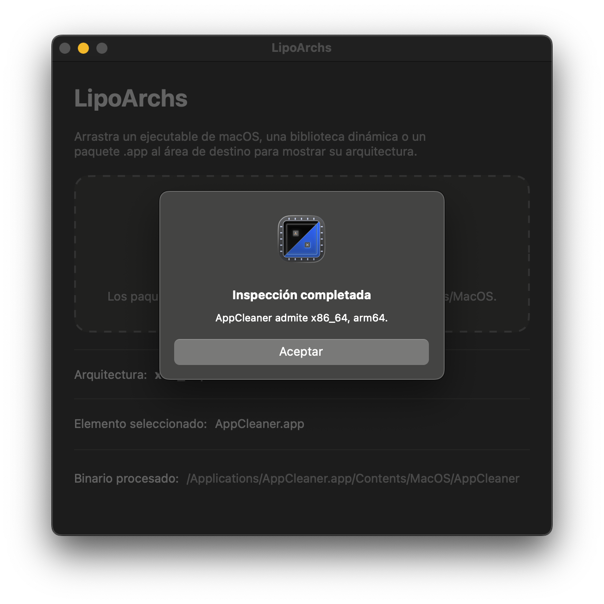

# LipoArchs

Aplicación de macOS desarrollada en SwiftUI para mostrar la(s) arquitectura(s) de un ejecutable, biblioteca dinámica o paquete `.app` que se suelta sobre la ventana.

## Requisitos

- macOS 13+
- Xcode 15+

## Comportamiento

- Arrastra un ejecutable Mach-O, `.dylib` o paquete `.app` a la ventana.
- Los paquetes `.app` se resuelven a `Contents/MacOS/<CFBundleExecutable>`.
- La ventana mantiene visibles en la interfaz las arquitecturas detectadas.
- Una alerta también informa si la inspección se completó o falló, y se cierra después de 4 segundos.
- Hay soporte de idiomas con detección automática del idioma del sistema (inglés y español por ahora).

## Motivación

En macOS existe el comando `lipo` que, junto con el argumento `-archs`, muestra la(s) arquitectura(s) de un ejecutable o biblioteca (por ejemplo, `x86_64` para Apple Intel, `arm64` para Apple Silicon).

Aunque usar este comando es simple, requiere mostrar el contenido de una aplicación, ya que el ejecutable ubicado en `Contents/MacOS` es el que debe pasarse a `lipo`.

LipoArchs ofrece una forma aún más simple de hacerlo: solamente hay que arrastrar la aplicación o biblioteca a la ventana de LipoArchs y obtendrás información de su(s) arquitectura(s). LipoArchs no requiere permisos especiales, ocupa muy poco espacio (2.2 MB) y no tiene opciones de configuración.

A pesar de su nombre, LipoArchs no usa `lipo`. Busca datos como tipo y subtipo de CPU para encontrar la(s) arquitectura(s) de esa CPU.
