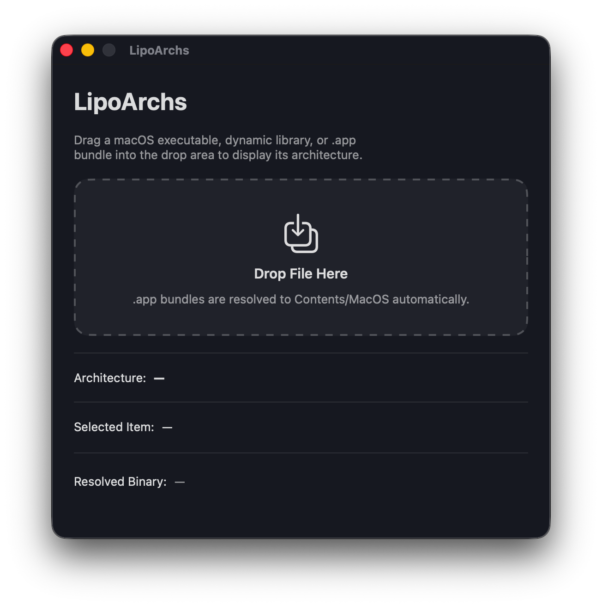
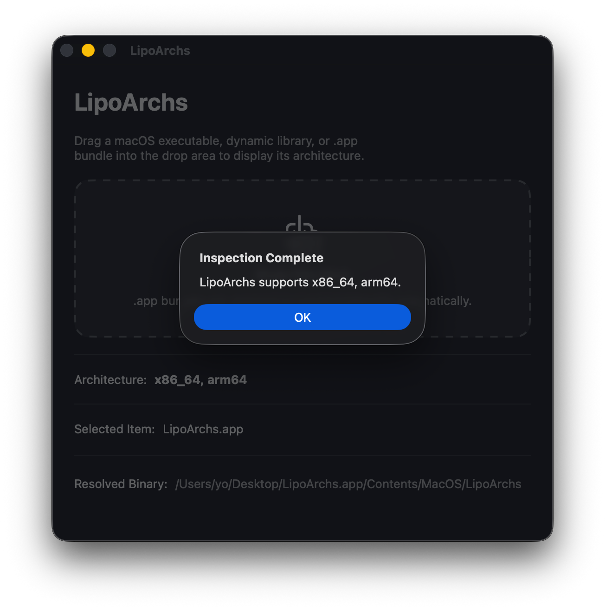

# LipoArchs

Minimal macOS SwiftUI app for displaying the architecture(s) of a dropped executable, dynamic library, or `.app` bundle.

## Requirements

- macOS 13+
- Xcode 15+

## Behavior

- Drag a Mach-O executable, `.dylib`, or `.app` bundle onto the window
- `.app` bundles are resolved to `Contents/MacOS/<CFBundleExecutable>`
- The window keeps the detected architectures visible in the interface
- An alert also reports whether inspection succeeded or failed, then closes after 4 seconds
- There is language support with automatic system language detection (English and Spanish for now)
